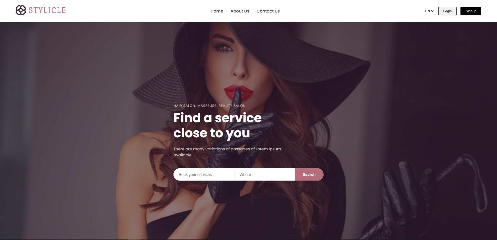

# Beauty Salon | Vanilla PHP App



[Other Screenhots](./assets/screenshots/)

[Design](https://www.figma.com/design/yUBTU3YSEETOeeHubgtoBS/%D1%81%D0%B0%D0%BB%D0%BE%D0%BD-%D0%BA%D1%80%D0%B0%D1%81%D0%BE%D1%82%D1%8B?node-id=1-656&t=l98qR9PPTmpH9UVy-1)

# Run Server

```bash
php -S localhost:8000
```

---

## Tech Stack

<p align="left">
  
  
</p>

---

## Project Structure

```
website/
├── index.php
├── config.php
├── includes/
│   ├── header.php
│   ├── footer.php
│   └── functions.php
├── pages/
│   ├── home.php
│   ├── about.php
│   └── contact.php
├── data/
│   └── projects.json
├── assets/
│   ├── css/
│   │   └── style.css
│   ├── js/
│   │   └── main.js
│   └── images/
└── .htaccess
```
