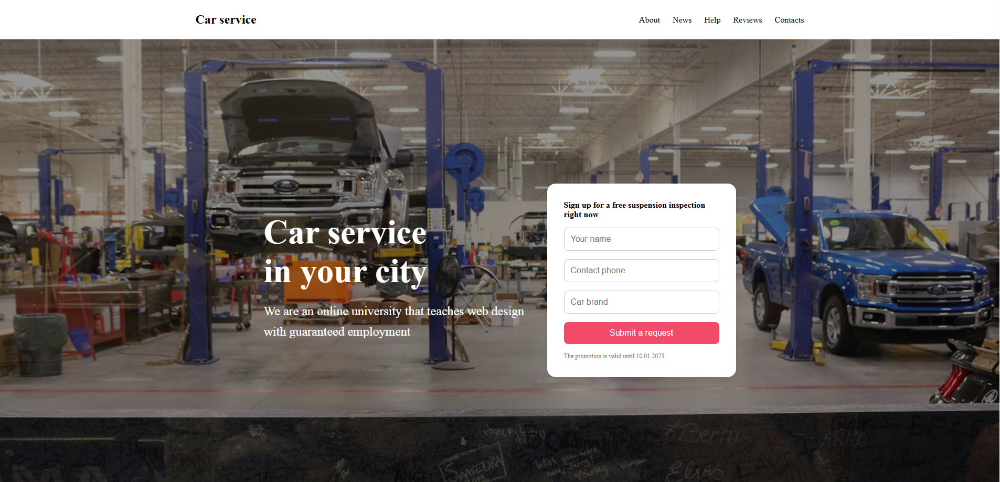

# Car service website

Adaptive lending for a car service, laid out using a design layout from Figma.

## Tech stack

- HTML5
- CSS3 (Flexbox, grid)
- Media queries (adaptable for 768px and 480px)
- Semantic layout
- Pixel Perfect

## Adaptability

The project is adapted for:

- Desktop (≥ 1024 pixels)
- Tablet (768px)
- Smartphone (≤ 480 pixels)

All sections of the site are correctly presented on different devices.

## Design

The layout was provided in Figma.
**Design**: [Link to the layout](https://www.figma.com/design/21sqAicmOxEWbIfxXQbGEK/%D0%B0%D0%B2%D1%82%D0%BE%D1%81%D0%B5%D1%80%D0%B2%D0%B8%D1%81?node-id=463-0&t=TzFxzuHVZIDJN1KM-1)

## PS

Due to the layout features, it was not possible to implement one of the blocks
