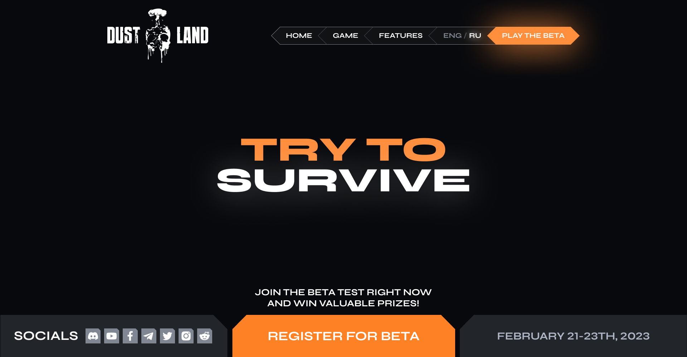

# DustLand Game Landing



- [Design](https://www.figma.com/design/Xnw0OrczQRUks1ENDAAVuv/%D0%BE%D0%BD%D0%BB%D0%B0%D0%B9%D0%BD-%D0%B8%D0%B3%D1%80%D0%B0?node-id=71-35287&t=0cKHPrMGovjPjxFc-1)
- [Demo](https://dmitrywork92.github.io/dustland_landing/)

# DustLand Game — Multi-Format Template

This repository contains several implementations of the **DustLand** multiplayer game website, including:

- Clean HTML/SCSS/JS layout
- WordPress theme

---

## Project structure

```bash
dustland_landing/
├── assets/ # Common styles, scripts, images
├── wp-theme/ # WordPress theme
├── django-version/ # Django application
└── README.md # This file
```

---

## Usage

### HTML

Open `html-version/index.html` in a browser. All styles and scripts are included from `../assets`.

### WordPress

1. Go to `wp-theme/`
2. Copy the folder to `wp-content/themes/` of your WordPress site
3. Activate the theme via the admin panel

## Features

- Unified layout for different stacks
- Convenient structure for maintenance
- Quick switching between formats

## Author

Developed by Adam Lean
