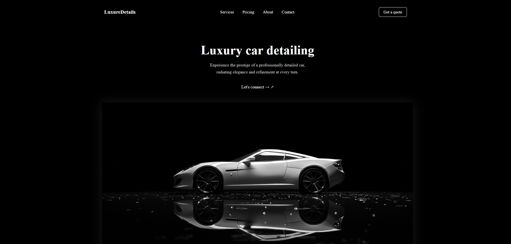

# Luxury Car Landing



- [Design](https://www.figma.com/design/YEuQIpkKqpy4m3olwAtd3v/Luxury-Car-Detailing-Landing-Page--Community-?node-id=2-139&t=tpUWEfg9TMW9uLps-1)
- [Demo](https://crashtheroutines.github.io/luxurycar_landing)

# Luxury Car Landing — Multi-format Template

This repository contains several implementations of one landing page **Luxury Car Landing**, including:

- Pure HTML/SCSS/JS layout
- WordPress theme
- Django version
- React version _(in development)_

---

## Project structure

```bash
luxurycar_landing/
├── assets/           # Common styles, scripts, images
├── ru/               # Russian HTML version
├── wp-theme/         # WordPress theme
├── django-version/   # Django application
└── README.md         # This file
```

---

## Usage

### HTML

Open `html-version/index.html` in a browser. All styles and scripts are included from `../assets`.

### WordPress

1. Go to `wp-theme/`
2. Copy the folder to `wp-content/themes/` of your WordPress site
3. Activate the theme via the admin panel

### Django

1. Go to `django-version/`
2. Install dependencies:

```bash
pip install -r requirements.txt

```

## Features

- Unified layout for different stacks
- Convenient structure for support
- Quick switching between formats

## In development

- React version
- Generating templates for CMS
- Possibility of API connection

## Author

Developed by CrashTheRoutines

_Русская версия Readme доступна в [ru](./ru/README.md)._
